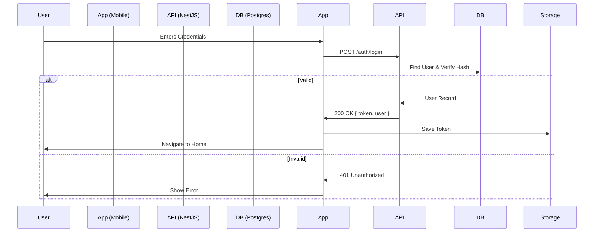

# Authentication Guide

## Overview
Helping Hand uses a custom authentication system based on **JWT (JSON Web Tokens)**.

## Architecture

### Backend (`apps/api`)
-   **Provider**: `AuthModule` (NestJS).
-   **Database**: `User` table (Prisma/Postgres).
-   **Hashing**: `bcrypt` for passwords.
-   **Strategies**: `Passport-JWT` for route protection.

#### Endpoints
-   `POST /auth/register`: Creates a new user. Returns `AuthResponseDto`.
-   `POST /auth/login`: Validates credentials. Returns `AuthResponseDto` (User + Token).
-   `GET /auth/me`: Validates token and returns current user profile (Protected).

### Frontend (`apps/mobile`)
-   **Repository**: `AuthRepository` (handles API calls).
-   **State Management**: `AuthNotifier` (Riverpod).
    -   Manages `AuthState` (Initial, Authenticated, Unauthenticated).
    -   Persists Token using `flutter_secure_storage`.
-   **Interceptor**: `AuthInterceptor` (Dio) automatically attaches `Authorization: Bearer <token>` to requests.

## Flow Diagram

## Security Implementation
-   **Passwords**: Never stored in plain text. Salted and hashed via bcrypt.
-   **Tokens**: Short-lived (configurable) JWTs signed with `JWT_SECRET`.
-   **Transport**: All Auth traffic must be over HTTPS in production.
